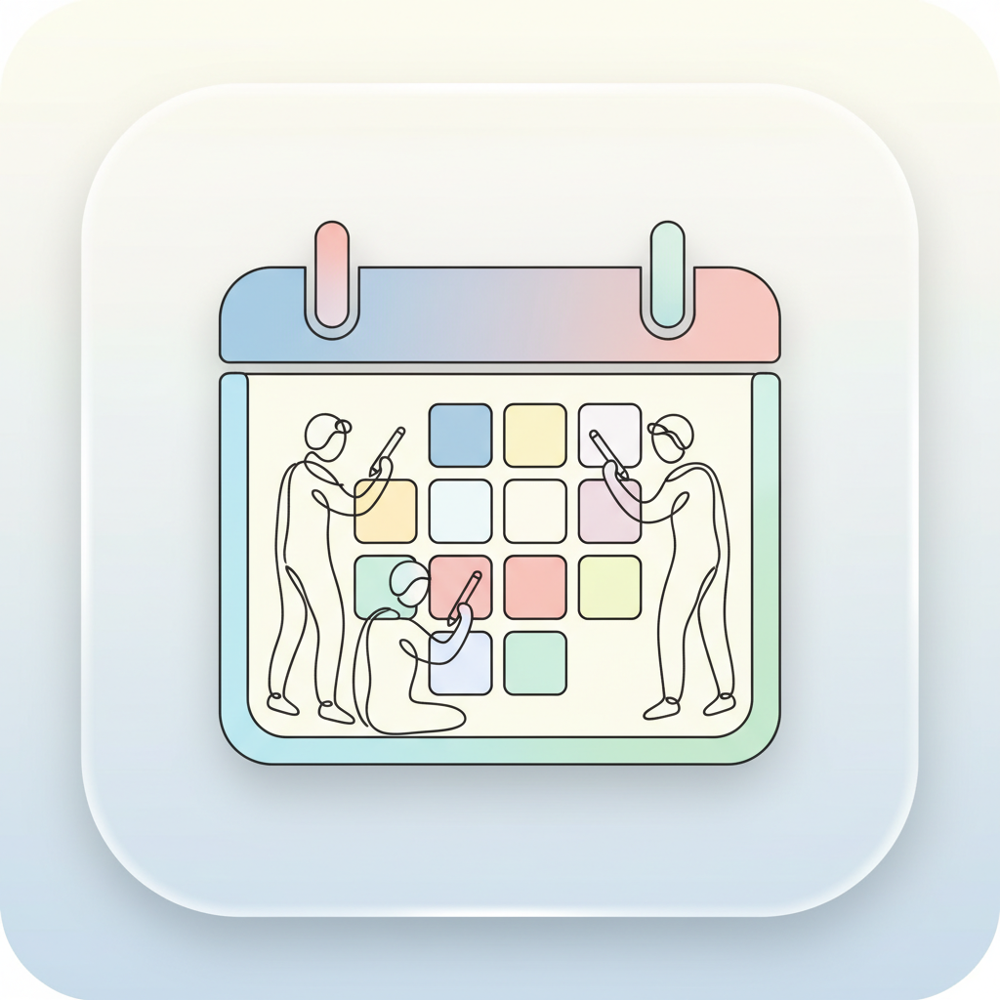
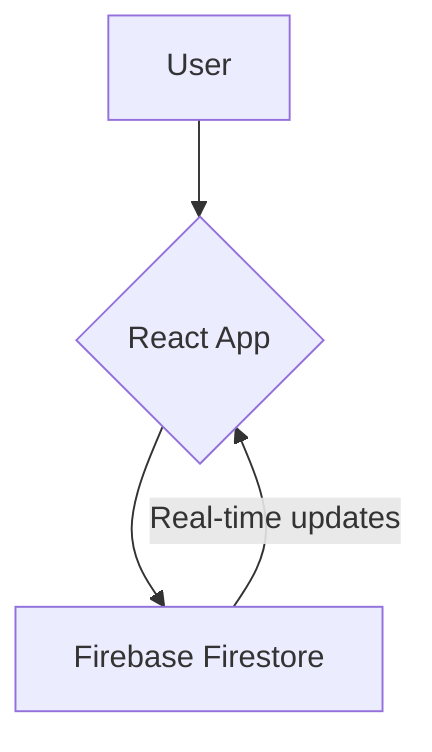

<div align="center">
  
  <h1>Collaborative Annual Planner</h1>
  <p>A real-time, collaborative annual planner with no login required.</p>
  
  <!-- Badges -->
  <p>
    <a href="https://github.com/javilopezg/calendar/actions/workflows/documentation.yml"></a>
    <a href="https://opensource.org/licenses/BSD-3-Clause"></a>
    <a href="package.json"></a>
    <a href="https://securityscorecards.dev/viewer/?uri=github.com/javilopezg/calendar"></a>
  </p>
</div>

<div align="center">
  
</div>

## 🚀 Quick Start

Get started with the Collaborative Annual Planner in just one command:

```bash
git clone https://github.com/javilopezg/calendar.git && cd calendar && npm install && npm run dev
```

Alternatively, you can use Docker:

```bash
docker run -p 8080:80 ghcr.io/javilopezg/calendar:main
```

## ✨ Features

*   **Real-time collaboration:** See changes from other users instantly.
*   **No login required:** Start planning right away without creating an account.
*   **Public modification:** Anyone with the link can view or edit the calendar.
*   **Print-friendly:** The user interface is optimized for A4 paper printing.
*   **Simple UX:** A clean and intuitive interface that is easy to use.

## 📦 Dependencies

*   [React](https://reactjs.org/)
*   [Vite](https://vitejs.dev/)
*   [Tailwind CSS](https://tailwindcss.com/)
*   [Firebase](https://firebase.google.com/)
*   [Lucide React](https://lucide.dev/guide/packages/lucide-react)

## 📖 Usage

The Collaborative Annual Planner is designed to be simple and intuitive. Here are a few user stories to help you get started:

*   **As a project manager,** I can create a new calendar for my team and share the link with them. Everyone can then add their tasks and deadlines to the calendar, and we can all see the project's progress in real-time.
*   **As a student,** I can create a calendar for my study group. We can use it to track our assignments, exams, and other important dates.
*   **As a family,** we can use the calendar to coordinate our schedules. We can add appointments, events, and other important information to the calendar so that everyone is on the same page.

### Architecture



## 🗺️ Roadmap

This is a weekend project, and future development depends on community interest. If you have any suggestions or feedback, please feel free to open an issue or submit a pull request.

## ❤️ Contributing

Suggestions, help, and feedback are welcome!

## 📜 License

This project is licensed under the BSD 3-Clause License. See the [LICENSE](LICENSE) file for details.