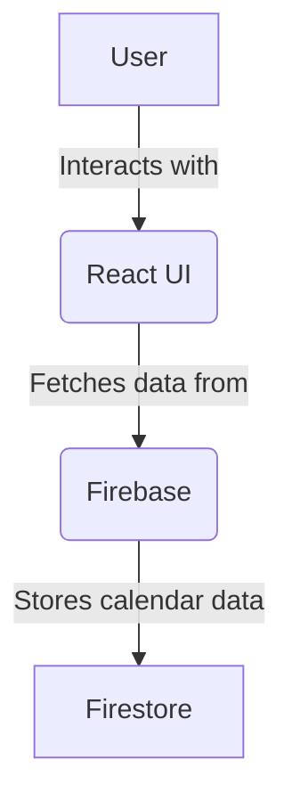

<div align="center">
<h1>👥🖨️🗓️✒️</h1>
</div>

# Social Printable Calendar Planner

[](https://github.com/JaviLopezG/calendar/actions/workflows/documentation.yml)
[](https://opensource.org/licenses/BSD-3-Clause)

[](https://api.securityscorecards.dev/projects/github.com/JaviLopezG/calendar)

> A social and printable calendar planner.

<!--TOC-->
<!--/TOC-->

## Quick Start

### Prerequisites

- [Node.js](https://nodejs.org/) (v18+)
- [Docker](https://www.docker.com/) (optional)

### Local Development

1.  **Clone the repository:**
    ```bash
    git clone https://github.com/javi/calendar.git
    cd calendar
    ```

2.  **Install dependencies:**
    ```bash
    npm install
    ```

3.  **Run the development server:**
    ```bash
    npm run dev
    ```

### Docker

You can also run the development environment inside a Docker container.

1.  **Build the image:**
    ```bash
    docker build -t calendar-dev .
    ```

2.  **Run the container:**
    ```bash
    docker run -p 5173:5173 -v .:/app calendar-dev
    ```
The application will be available at `http://localhost:5173`.

## Usage

<!-- Add usage instructions and examples here. -->

### Architecture



## License

This project is licensed under the BSD-3-Clause License - see the [LICENSE](LICENSE) file for details.